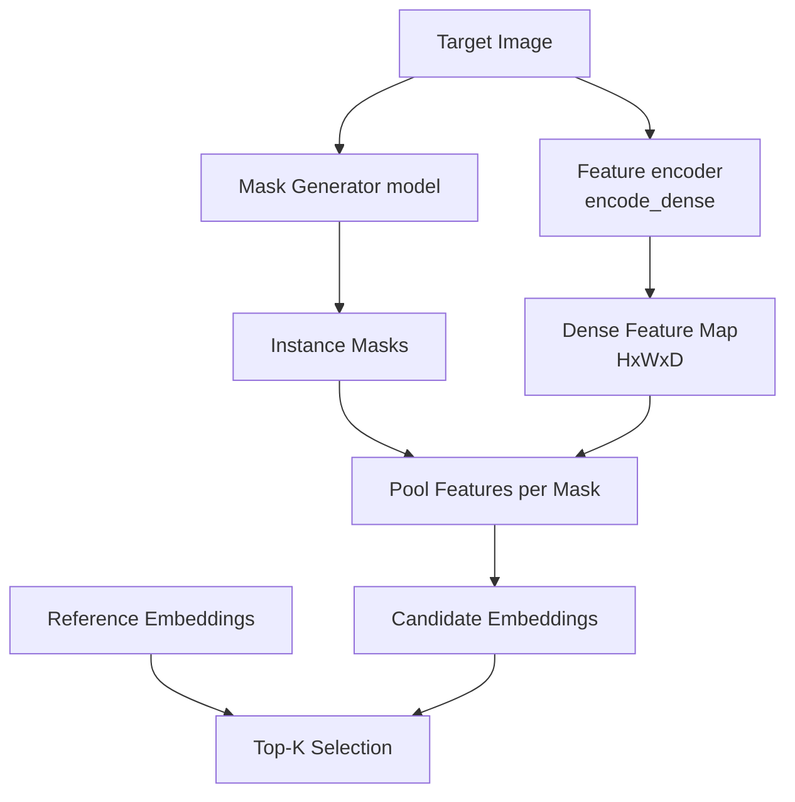
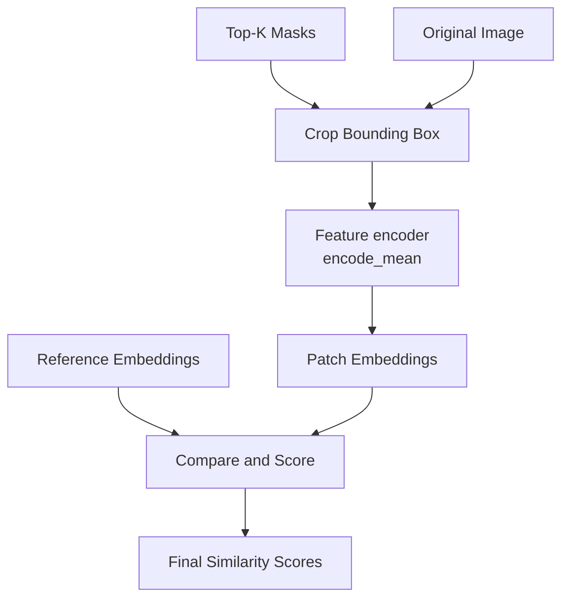

# Find Anything
[](https://www.python.org/downloads/)
[](https://codecov.io/github/starswaterbrook/find-anything)
[](http://mypy-lang.org/)
[](https://github.com/astral-sh/ruff)
[](LICENSE)

Zero-shot object detection library that finds objects in rich images by matching against reference images. 

## Installation

Requires Python 3.12+

```bash
# With CUDA 12.8 support
pip install find-anything[cuda128] --extra-index-url https://download.pytorch.org/whl/cu128

# CPU only
pip install find-anything[cpu]
```

### Warning
Due to `ultralytics` being broken - FastSAM dependency, outdated for `torch` - you might need to apply a fix if you are seeing this error:
```
_pickle.UnpicklingError: Weights only load failed. This file can still be loaded...
```
The fix - add `weights_only=False` in  `<venv_path>\site-packages\ultralytics\nn\tasks.py` line 518:
```python
# before
return torch.load(file, map_location='cpu'), file
# after
return torch.load(file, map_location='cpu', weights_only=False), file
```
Make sure to only load trusted model weights as this bypasses some safety checks.

## Usage
### Basic Example - DINOv2 + FastSAM

```python
from PIL import Image
from find_anything import (
    ZeroShotObjectMatcher,
    DinoV2FeatureEncoder,
    FastSAMMaskGenerator,
    DenseFeatureMaskPooler,
    TopKMaskSelector,
    BaseEmbeddingRepository,
)

device = "cuda"  # or "cpu"

encoder = DinoV2FeatureEncoder(device=device)
mask_generator = FastSAMMaskGenerator(model_path="FastSAM-x.pt", device=device)
# Adjust min_mask_area as needed - smaller values allow smaller ROIs
mask_pooler = DenseFeatureMaskPooler(min_mask_area=1, device=device)
embedding_repository = BaseEmbeddingRepository(encoder=encoder)
mask_selector = TopKMaskSelector(base_embeddings=embedding_repository, top_k=5)

matcher = ZeroShotObjectMatcher(
    encoder=encoder,
    mask_generator=mask_generator,
    mask_pooler=mask_pooler,
    mask_selector=mask_selector,
    base_embeddings=embedding_repository,
    similarity_threshold=0.5,
)

reference_images = [
    Image.open("reference1.jpg"),
    Image.open("reference2.jpg"),
]
matcher.set_base_images(reference_images)

target_image = Image.open("target.jpg")
results = matcher.forward_from_image(target_image)

for result in results:
    print(f"Match found: similarity={result.similarity:.3f}, reference_idx={result.matched_base}")
    mask = result.mask  # torch.Tensor with segmentation mask
```

## Architecture

The detector uses a two-stage coarse-to-fine matching approach that balances computational efficiency with matching accuracy.

### Stage 1: Coarse Filtering (Pooled Dense Features)



The first stage processes the entire image once through the encoder to produce a dense feature map where each spatial location has a feature vector. The mask generator simultaneously generates instance segmentation masks for all objects in the scene.

For each mask, features from the dense map are pooled within the masked region to produce a single embedding per candidate object. These pooled embeddings are compared against reference embeddings, and only the best candidates proceed to the next stage.

### Stage 2: Fine Matching (Cropped Patch Encoding)



The second stage takes each selected candidate mask, extracts the bounding box crop from the original image, and encodes it independently. This produces a more accurate embedding:

1. The cropped patch is resized to the model's native resolution, giving the object more pixels and detail
2. The encoding focuses entirely on the object without background interference from pooling
3. Spatial information is better preserved compared to averaging over irregular mask shapes

### Why Two Stages?

The coarse stage acts as a fast filter to eliminate obviously non-matching regions. Without it, every detected mask would require a separate forward pass through the encoder, which is expensive - with possibly dozen of masks generated, this would significantly slow down the process for rich scenes.

The fine stage provides the accuracy needed for reliable matching. Pooled dense features can miss details or be contaminated by background pixels that fall within the mask but don't belong to the object.

Together the stages achieve both speed (single dense encoding + K patch encodings) and accuracy (dedicated high-resolution encoding of important regions for final candidates).

For the concrete implementations provided, we use DINOv2 as the feature encoder and FastSAM as the mask generator - the latter's good performance is crucial to ensure high-quality region proposals for effective matching. I recommend using the "x" variant for best results.

### Components

| Component | Role |
|-----------|------|
| `FeatureEncoder` | Extracts semantic features |
| `MaskGenerator` | Generates instance segmentation masks for all objects |
| `MaskPooler` | Pools dense features within mask regions |
| `MaskSelector` | Selects top mask candidates |
| `EmbeddingRepository` | Stores reference image embeddings |
| `ZeroShotObjectMatcher` | Orchestrates the full pipeline |

The modular design allows swapping different encoders, mask generators, or pooling/selection strategies as needed.

## License

MIT
